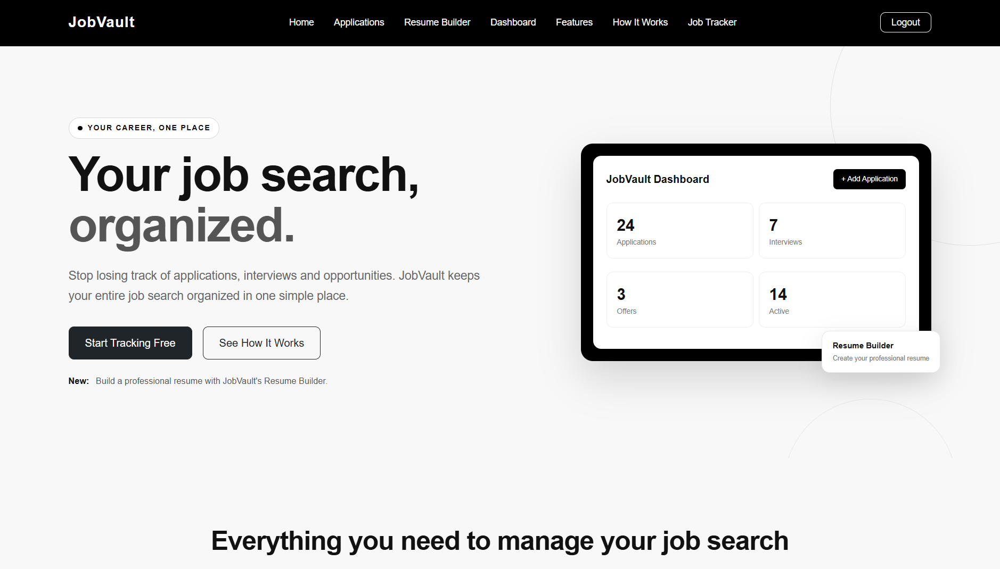
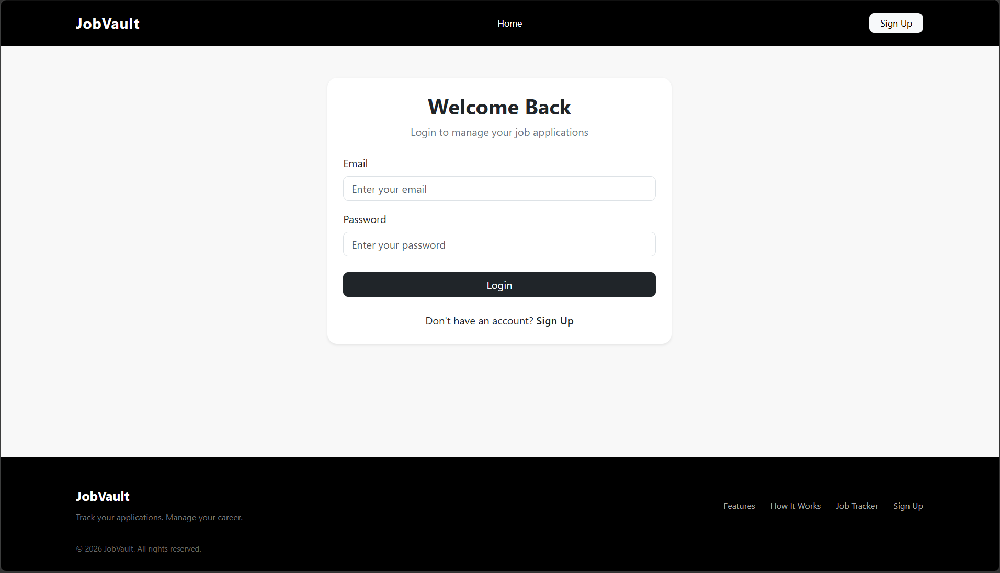
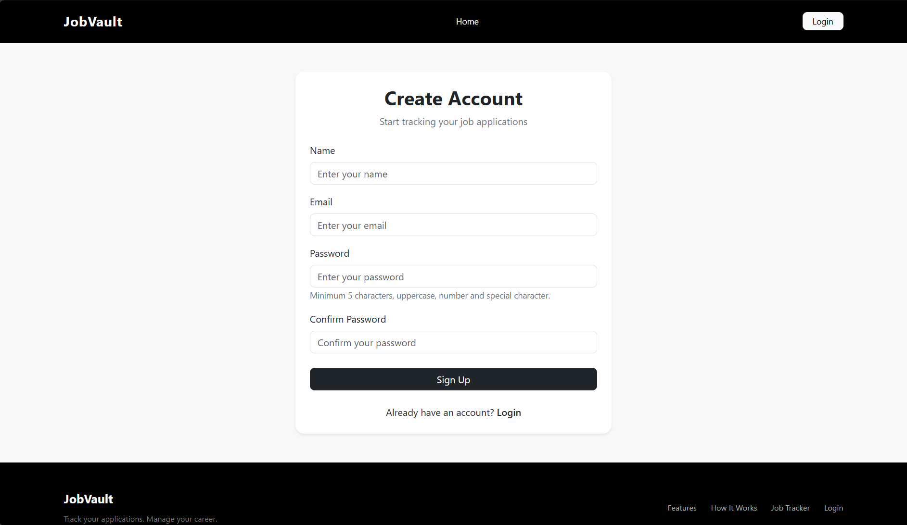
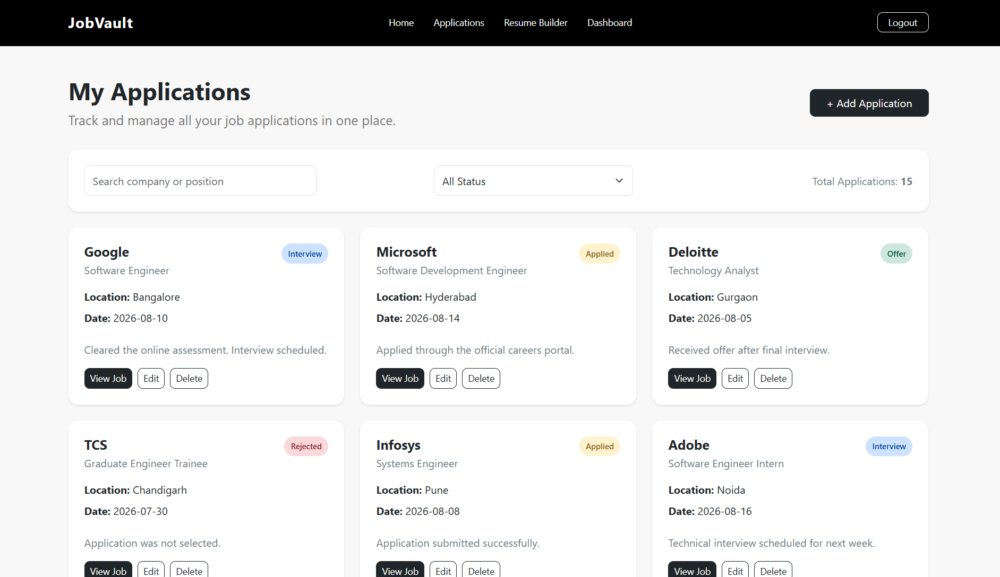
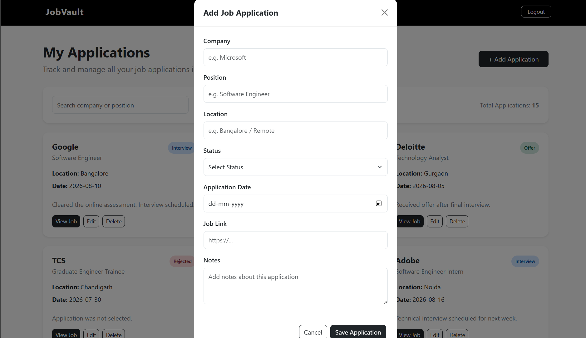
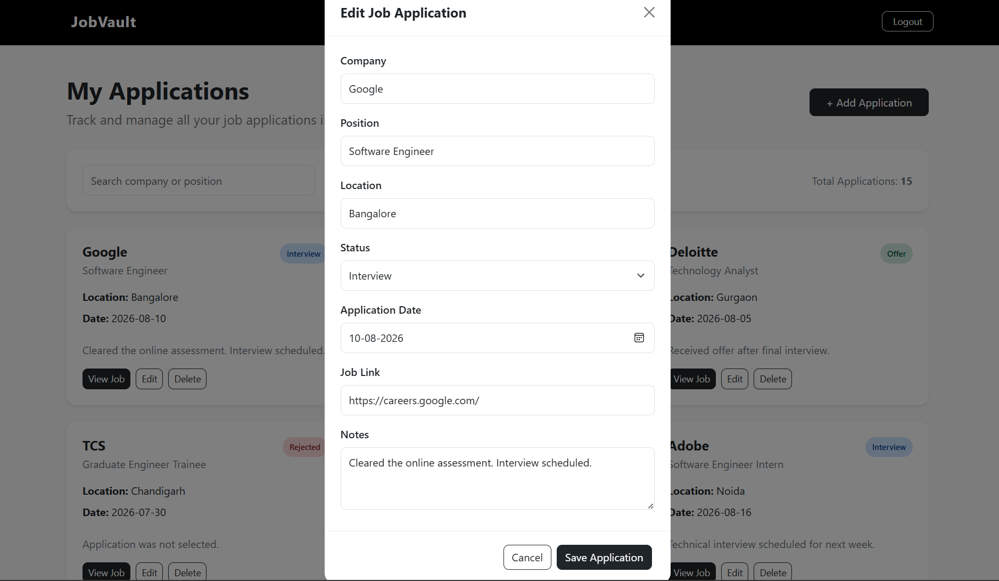
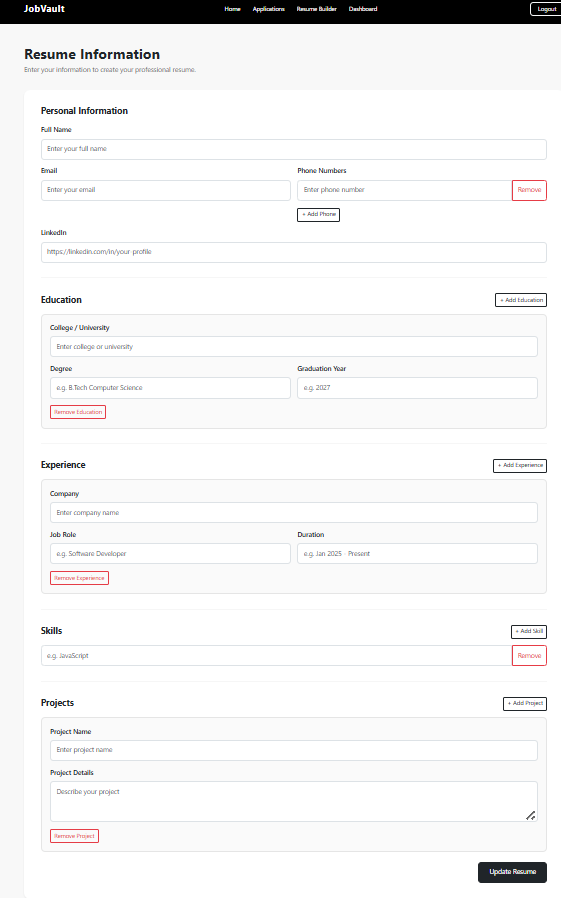

# 🚀 JobVault - Job Application Tracker & Resume Builder

JobVault is a web-based career management application that helps users organize their job applications and create professional resumes from one place.

The application combines **job application tracking, application analytics, authentication, and resume building** into a single platform designed to simplify the job-search process.

---

## 📌 Overview

JobVault provides users with a centralized platform to manage different stages of their job search.

Users can:

- Create an account
- Login and manage their session
- Add job applications
- View their applications
- Edit existing applications
- Delete applications
- Track application status
- View application statistics
- Access job links directly
- Add notes to applications
- Build and manage their resume
- View their job-search activity through a dashboard

---

## ✨ Features

### 🔐 Authentication

- User registration
- Login system
- Session-based authentication
- Logout functionality
- Protected application pages

### 📋 Job Application Tracking

Users can create and manage applications containing:

- Company name
- Job position
- Location
- Application status
- Application date
- Job posting link
- Notes

### ✏️ Edit Applications

Existing applications can be edited without creating duplicate records.

### 🗑️ Delete Applications

Users can delete applications they no longer want to track.

### 🎨 Application Status Tracking

Applications are visually categorized according to their status:

- 🟡 Applied
- 🔵 Interview
- 🟢 Offer
- 🔴 Rejected

### 📊 Dashboard

The dashboard provides an overview of the user's job search, including:

- Total applications
- Applied applications
- Interviews
- Offers
- Application status overview

### 📈 Application Analytics

JobVault provides a visual breakdown of application statuses so users can quickly understand their application progress.

### 📄 Resume Builder

JobVault also includes a resume builder that allows users to create a professional resume directly within the application.

Users can build their resume by entering relevant career information and generate a structured resume without leaving the platform.

The Resume Builder is designed to make it easier for users to:

- Create a resume
- Organize professional information
- Maintain resume details
- Prepare a resume while applying for jobs

---

## 🛠️ Tech Stack

| Technology | Purpose |
|------------|---------|
| HTML5 | Page structure |
| CSS3 | Styling |
| JavaScript | Application logic |
| Bootstrap 5 | Responsive UI |
| JSON Server | Mock REST API |
| Chart.js | Application analytics |
| Git & GitHub | Version control |

---

## 📸 Screenshots

### 🏠 Home Dashboard



### 🔐 Login



### 📝 Sign Up



### 📋 Applications



### ➕ Add Application



### ✏️ Edit Application



### 📄 Resume Builder



---

## 📂 Project Structure

```text
Job-Application-Tracker/
│
├── index.html
├── login.html
├── signup.html
├── home.html
├── applications.html
├── resume.html
│
├── db.example.json
├── .gitignore
├── README.md
│
└── screenshots/
    ├── home.png
    ├── login.png
    ├── signup.png
    ├── applications.png
    ├── add-application.png
    ├── edit-application.png
    └── resume-builder.png